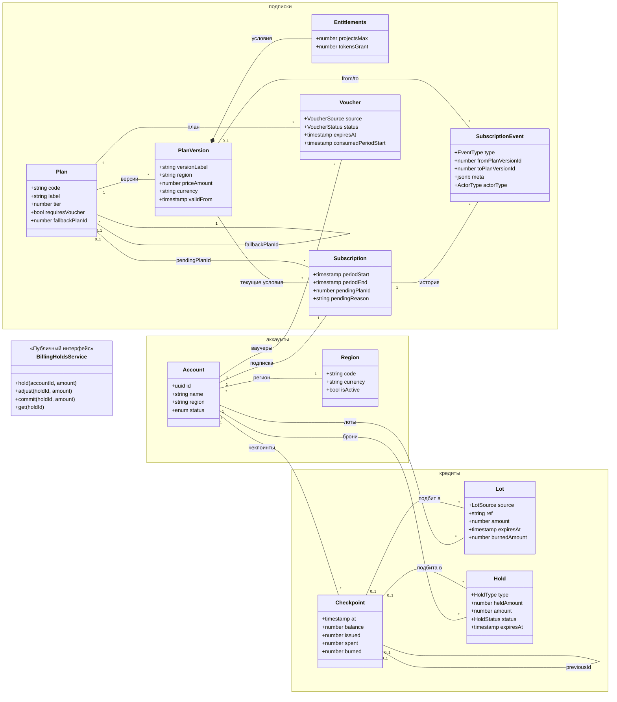

```mermaid
classDiagram
    direction LR

    namespace аккаунты {
        class Region {
            +string code
            +string currency
            +bool isActive
        }
        class Account {
            +uuid id
            +string name
            +string region
            +enum status
        }
    }

    namespace подписки {
        class Plan {
            +string code
            +string label
            +number tier
            +bool requiresVoucher
            +number fallbackPlanId
        }
        class PlanVersion {
            +string versionLabel
            +string region
            +number priceAmount
            +string currency
            +timestamp validFrom
        }
        class Entitlements {
            +number projectsMax
            +number tokensGrant
        }
        class Subscription {
            +timestamp periodStart
            +timestamp periodEnd
            +number pendingPlanId
            +string pendingReason
        }
        class SubscriptionEvent {
            +EventType type
            +number fromPlanVersionId
            +number toPlanVersionId
            +jsonb meta
            +ActorType actorType
        }
        class Voucher {
            +VoucherSource source
            +VoucherStatus status
            +timestamp expiresAt
            +timestamp consumedPeriodStart
        }
    }

    namespace кредиты {
        class Lot {
            +LotSource source
            +string ref
            +number amount
            +timestamp expiresAt
            +number burnedAmount
        }
        class Hold {
            +HoldType type
            +number heldAmount
            +number amount
            +HoldStatus status
            +timestamp expiresAt
        }
        class Checkpoint {
            +timestamp at
            +number balance
            +number issued
            +number spent
            +number burned
        }
    }

    class BillingHoldsService {
        <<Публичный интерфейс>>
        +hold(accountId, amount)
        +adjust(holdId, amount)
        +commit(holdId, amount)
        +get(holdId)
    }

    Account "*" -- "1" Region : регион
    Plan "1" -- "*" PlanVersion : версии
    PlanVersion *-- Entitlements : условия
    Plan "0..1" -- "*" Plan : fallbackPlanId
    Account "1" -- "1" Subscription : подписка
    PlanVersion "1" -- "*" Subscription : текущие условия
    Plan "0..1" -- "*" Subscription : pendingPlanId
    Subscription "1" -- "*" SubscriptionEvent : история
    PlanVersion "0..1" -- "*" SubscriptionEvent : from/to
    Account "1" -- "*" Voucher : ваучеры
    Plan "1" -- "*" Voucher : план
    Account "1" -- "*" Lot : лоты
    Checkpoint "0..1" -- "*" Lot : подбит в
    Account "1" -- "*" Hold : брони
    Checkpoint "0..1" -- "*" Hold : подбита в
    Account "1" -- "*" Checkpoint : чекпоинты
    Checkpoint "0..1" -- "0..1" Checkpoint : previousId
```
