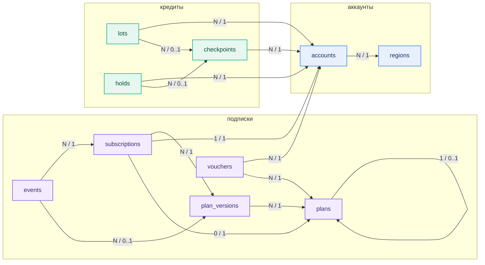

```mermaid
flowchart LR
    classDef acc fill:#e8f0fe,stroke:#4285f4,stroke-width:1.5px,color:#17325c
    classDef subs fill:#f3ecfe,stroke:#8b5cf6,stroke-width:1.5px,color:#3f2a72
    classDef cred fill:#e6f7ef,stroke:#10b981,stroke-width:1.5px,color:#0b4a34

    subgraph G1["аккаунты"]
        REG["regions"]
        ACC["accounts"]
    end

    subgraph G2["подписки"]
        PLAN["plans"]
        PV["plan_versions"]
        SUB["subscriptions"]
        EVT["events"]
        VCH["vouchers"]
    end

    subgraph G3["кредиты"]
        LOT["lots"]
        HOLD["holds"]
        CP["checkpoints"]
    end

    ACC -->|"N / 1"| REG
    PV -->|"N / 1"| PLAN
    SUB -->|"N / 1"| PV
    SUB -->|"1 / 1"| ACC
    VCH -->|"N / 1"| ACC
    VCH -->|"N / 1"| PLAN
    LOT -->|"N / 1"| ACC
    HOLD -->|"N / 1"| ACC
    CP -->|"N / 1"| ACC
    EVT -->|"N / 1"| SUB

    SUB -->|"0 / 1"| PLAN
    EVT -->|"N / 0..1"| PV
    LOT -->|"N / 0..1"| CP
    HOLD -->|"N / 0..1"| CP
    PLAN -->|"1 / 0..1"| PLAN

    class REG,ACC acc
    class PLAN,PV,SUB,EVT,VCH subs
    class LOT,HOLD,CP cred
```
